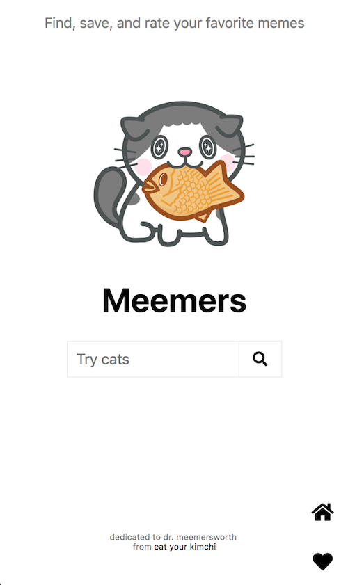
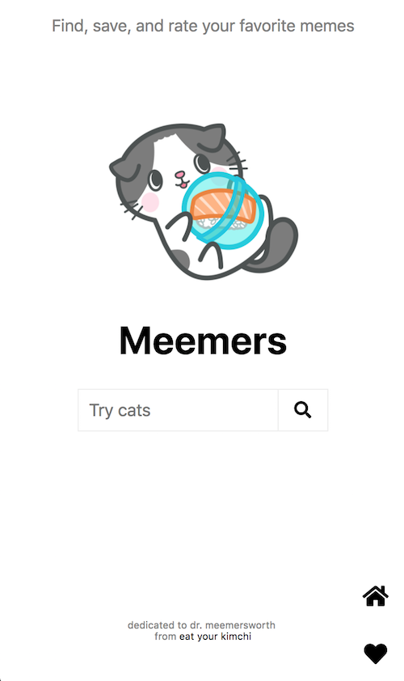
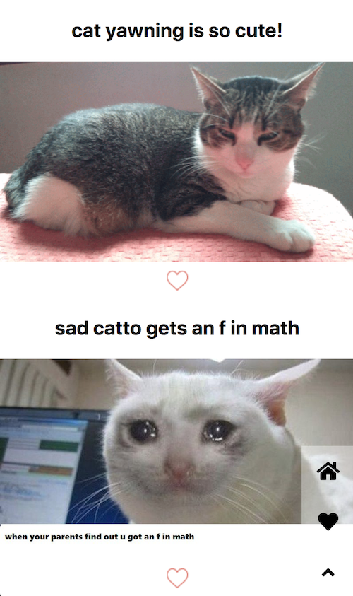

# Meemers
## Fully responsive Ruby on Rails application for searching, saving, and rating memes

## Built with:
* Ruby on Rails
* PostgreSQL

## Screenshots:
Home page:

Sample search results:

Mobile:

Web:

Sample favorites:

## Basic functionality:
* Users can search for memes on the Home page via the Imgur API
* Favorited memes are saved to the Postgres database via AJAX and displayed on the Faves page
* Users can add likes (hearts) to their favorite memes via AJAX

## Acknowledgements
* Credits: [Eat Your Kimchi](http://www.eatyourkimchi.com/introducing-dr-meemersworth/)
* Inspiration: Pinterest